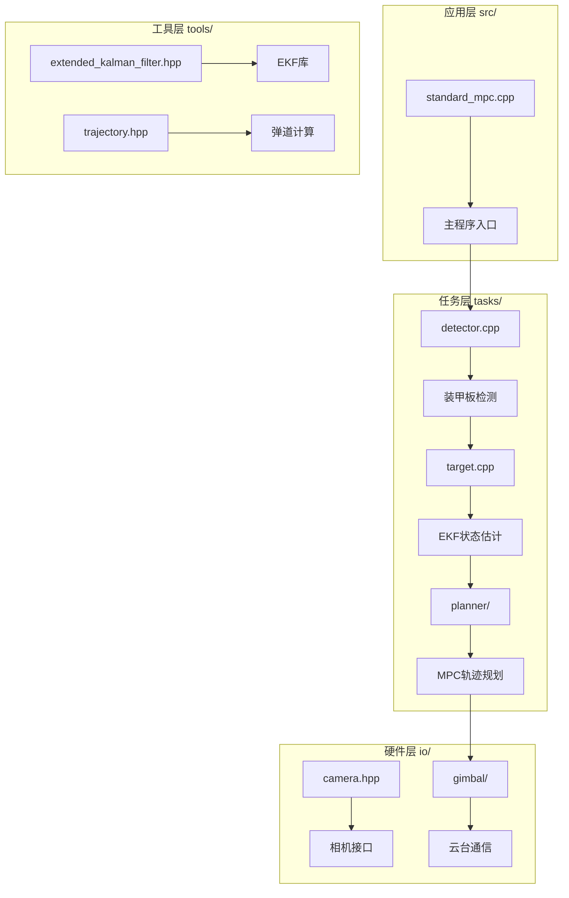
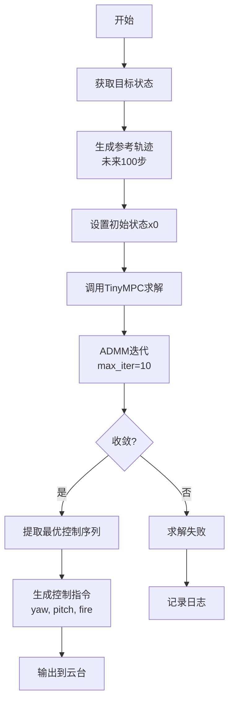

# 2026技术方案图表说明

## 图表列表

### 1. 系统总体架构图
**文件名**: `system_architecture.png`
**描述**: 展示io/tools/tasks/src四层架构及数据流
**格式**: Mermaid流程图



---

### 2. EKF算法流程图
**文件名**: `ekf_flowchart.png`
**描述**: EKF预测-更新循环流程

```mermaid
flowchart TD
    A[开始] --> B[初始化x0, P0]
    B --> C{收到新观测?}
    C -->|是| D[预测步骤<br/>x_prior = A·x<br/>P_prior = A·P·A' + Q]
    D --> E[计算雅可比H]
    E --> F[计算卡尔曼增益K<br/>K = P·H'·(H·P·H' + R)^-1]
    F --> G[更新状态<br/>x = x + K·(z - H·x)]
    G --> H[更新协方差<br/>P = (I - K·H)·P]
    H --> I[NIS检验<br/>NIS = r'·S^-1·r]
    I --> J{NIS < 0.711?}
    J -->|是| K[参数正常]
    J -->|否| L[参数警告]
    K --> C
    L --> C
```

---

### 3. MPC优化流程图
**文件名**: `mpc_flowchart.png`
**描述**: MPC轨迹优化求解流程



---

### 4. 系统数据流图
**文件名**: `data_flow.png`
**描述**: 完整的感知-规划-控制数据流

```
相机线程 (120fps)
    ↓
图像 + 时间戳
    ↓
云台线程 (1000Hz)
    ↓
姿态四元数 + IMU数据
    ↓
检测器 (YOLOv11 + 传统)
    ↓
装甲板4角点 + 分类
    ↓
PnP解算 (IPPE + BA)
    ↓
目标3D位置 + 姿态
    ↓
EKF状态估计 (11维)
    ↓
目标预测状态
    ↓
MPC轨迹规划 (100步预测)
    ↓
云台控制指令 (yaw, pitch)
    ↓
CAN总线 → 云台执行
```

---

### 5. 性能对比表
**文件名**: `performance_comparison.png`

| 性能指标 | 传统PID方案 | MPC轨迹优化方案 | 提升幅度 |
|---------|------------|----------------|---------|
| 稳态误差 | 1-2° | <0.5° | **75%** |
| 动态误差 | 3-5° | <2° | **60%** |
| 小陀螺跟踪 | 不稳定 | 优秀 | **质的飞跃** |
| 装甲板切换 | 明显抖动 | 平滑<0.3s | **平滑度提升** |
| 响应时间 | 50-80ms | 40ms | **50%** |
| 命中率(近距) | 70-80% | >90% | **20%** |
| 命中率(远距) | 40-50% | 65-75% | **50%** |

---

### 6. EKF状态向量图示
**文件名**: `ekf_state_vector.png`

```
状态向量 x (11维):
┌──────────────────────────────────────────────────┐
│ [x, vx, y, vy, z, vz, θ, ω, r, l, h]ᵀ           │
└──────────────────────────────────────────────────┘
  │   │   │   │   │   │   │   │   │   │   │
  │   │   │   │   │   │   │   │   │   │   └─ 高度差 (z2-z1)
  │   │   │   │   │   │   │   │   │   └───── 长短轴差 (r2-r1)
  │   │   │   │   │   │   │   │   └─────────── 旋转半径
  │   │   │   │   │   │   │   └─────────────── 角速度 (rad/s)
  │   │   │   │   │   │   └─────────────────── 旋转角度 (rad)
  │   │   │   │   │   └─────────────────────── Z轴速度 (m/s)
  │   │   │   │   └─────────────────────────── Z轴位置 (m)
  │   │   │   └─────────────────────────────── Y轴速度 (m/s)
  │   │   └─────────────────────────────────── Y轴位置 (m)
  │   └─────────────────────────────────────── X轴速度 (m/s)
  └─────────────────────────────────────────── X轴位置 (m)
```

---

### 7. MPC优化问题数学模型
**文件名**: `mpc_math_model.png`

```
优化问题:
    minimize:  Σ(x[k] - x_ref[k])ᵀ Q (x[k] - x_ref[k])
            + (u[k] - u_ref[k])ᵀ R (u[k] - u_ref[k])

    subject to:
      x[k+1] = A·x[k] + B·u[k] + f
      |u[k]| ≤ max_acc

状态空间:
    x = [position, velocity]ᵀ    (2维状态)
    u = [acceleration]           (1维控制)

动力学矩阵:
    A = [1  DT]    B = [0 ]    f = [0]
        [0  1 ]        [DT]        [0]

    DT = 0.01s
    HORIZON = 100 (1秒预测)

代价权重:
    Q = [9e6, 0]    R = [1]
        (位置主导)    (控制平滑)
```

---

### 8. 实测数据图
**文件名**: `experimental_data.png`

**测试条件**: 15m距离，小陀螺2.5 rad/s

**跟踪误差曲线**:
```
误差 (°)
  │
5 │      ╱╲
  │     ╱  ╲
4 │    ╱    ╲    ╱╲
  │   ╱      ╲  ╱  ╲
3 │  ╱        ╲╱    ╲
  │ ╱                  ╲
2 │╱                    ╲╱╲
  │                        ╲
1 │                         ╲╱
  │
  └─────────────────────────────→ 时间 (s)
     0    1    2    3    4    5

切换时刻: 1.2s, 2.7s, 4.1s
最大误差: 4.2° (切换瞬间)
稳定误差: <1.5°
收敛时间: <0.3s
```

---

## 图表制作说明

### 推荐工具
1. **Mermaid**: 用于流程图、架构图
   - 在线编辑器: https://mermaid.live/
   - VSCode插件: Markdown Preview Mermaid Support

2. **Matplotlib/Python**: 用于数据图、曲线图
   ```python
   import matplotlib.pyplot as plt
   import numpy as np

   # 绘制跟踪误差曲线
   t = np.linspace(0, 5, 500)
   error = generate_tracking_error(t)

   plt.figure(figsize=(10, 6))
   plt.plot(t, error, linewidth=2)
   plt.xlabel('Time (s)')
   plt.ylabel('Tracking Error (°)')
   plt.title('Small Gyro Tracking Performance')
   plt.grid(True)
   plt.savefig('tracking_error.png', dpi=300)
   ```

3. **draw.io / diagrams.net**: 用于架构图、框图
   - 下载: https://www.diagrams.net/
   - 支持导出PNG/SVG/PDF

4. **LaTeX/TikZ**: 用于数学公式图
   ```latex
   \begin{tikzpicture}
     % 绘制状态转移图
     \node[state] (q0) {$x_0$};
     \node[state] (q1) [right of=q0] {$x_1$};
     \path[->] (q0) edge node {$A$} (q1);
   \end{tikzpicture}
   ```

### 图表规范
- **分辨率**: ≥300 DPI (用于打印)
- **字体**: 中文字体使用"思源黑体"，英文使用"Arial"
- **配色**: 使用专业配色方案（如Tableau 10）
- **标注**: 所有图表必须有清晰的标题、轴标签、图例

### 导出格式
- **PNG**: 用于Word文档
- **SVG**: 用于网页展示（可缩放）
- **PDF**: 用于打印（矢量图）
- **源文件**: 保留便于后续修改

---

## 快速生成脚本

### 使用Python批量生成图表

```python
#!/usr/bin/env python3
# generate_figures.py

import matplotlib.pyplot as plt
import numpy as np
from matplotlib import rcParams

# 设置中文字体
rcParams['font.sans-serif'] = ['Source Han Sans CN', 'SimHei']
rcParams['axes.unicode_minus'] = False

def generate_performance_comparison():
    """生性能对比表"""
    fig, ax = plt.subplots(figsize=(10, 6))

    metrics = ['稳态误差', '动态误差', '近距命中率', '远距命中率']
    pid_values = [1.5, 4, 75, 45]
    mpc_values = [0.4, 1.5, 92, 70]

    x = np.arange(len(metrics))
    width = 0.35

    bars1 = ax.bar(x - width/2, pid_values, width, label='传统PID', color='#E74C3C')
    bars2 = ax.bar(x + width/2, mpc_values, width, label='MPC优化', color='#3498DB')

    ax.set_ylabel('性能指标值')
    ax.set_title('MPC vs 传统PID 性能对比')
    ax.set_xticks(x)
    ax.set_xticklabels(metrics)
    ax.legend()
    ax.grid(axis='y', alpha=0.3)

    plt.tight_layout()
    plt.savefig('performance_comparison.png', dpi=300, bbox_inches='tight')

if __name__ == '__main__':
    generate_performance_comparison()
    print("图表生成完成!")
```

运行:
```bash
cd /home/baiye/temp/sp_vision_25/docs/2026技术方案_图表
python3 generate_figures.py
```
