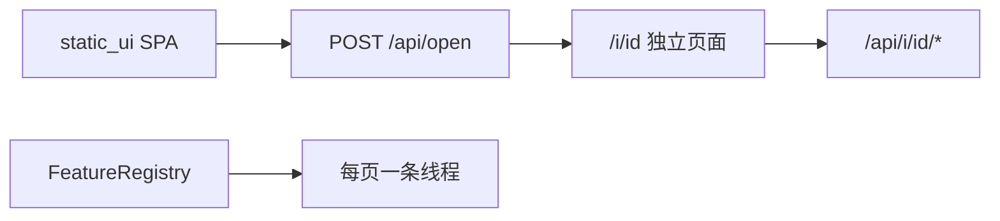

# Host 内部设计

给改 host 的程序员和 Agent 用。用法入口见 [`HOST.md`](HOST.md)。控制协议见 [`PROTOCOL.md`](PROTOCOL.md)。车上发送端见 [`../REMOTE_LOGGER.md`](../REMOTE_LOGGER.md)。

本文约定：路径相对 `host/`。包名 `rdbg`。主入口 `./host/start.sh` → `python -m rdbg serve`。

---

## 0. Hub + Feature 框架（当前主线）

```
host/
  start.sh                 统一门户
  ui/                      Vite+React+TS（FeatureModule 注册表）
  rdbg/
    apps/hub_app.py        单进程 HTTP + FeatureRegistry
    features/              Feature 插件（独立线程生命周期）
      base.py / fleet_bound.py / registry.py
      watch.py / calibrate.py / replay.py / dump.py / netcheck.py
    calib_cmds.py          标定命令共用（feature + legacy app）
    util.py                parse_stream_list / sse_state
    static_ui/             ui 构建产物（SPA）
    sources/ live|replay   仍被 Feature 薄封装复用
```



### 扩展新功能

1. **后端**：`features/foo.py` 继承 `Feature`（或需要绑车时继承 `FleetBoundFeature`），`attach` 里用 `self.api_prefix` 注册路由；把类加进 `features/registry.py` 的 `KINDS`。
2. **前端**：`ui/src/features/foo/FooPage.tsx` + 在 `ui/src/features/registry.ts` 追加一项。页面里用 `useInstance().base` 调本实例 API。标定例外：沿用 `static/calibrate.html`，由 `Feature.ui_path` 指向。
3. `./host/ui/build.sh`，再 `./host/start.sh`。

现有 Feature：`watch` / `calibrate` / `tfviz` / `replay` / `dump` / `netcheck`。

`FleetBoundFeature`：Watch / Calibrate / TF Viz 共用 fleet 绑定、`/events` SSE、`/bind`、`/select`、`/state`。子类用 `allow_rebind` / `default_img_streams` / `use_source_push_state` 区分行为。

控制面：`GET /api/features`（种类），`POST /api/open` 新建实例并启动线程，`GET /api/instances`，`POST /api/instances/<id>/stop?forget=1`（关页时）。  
业务 API 挂在 `/api/i/<id>/...`。关掉浏览器页会 `sendBeacon` 停掉该线程。发现口 `15999` 全局一个。每辆车单独分配数据口（自 15001）和对等口（自 15100）；打开 Watch 时选定车辆。同一辆车的多个 Watch 共用这一对口。`GET /api/robots` 列出当前 beacon，带 `app`（`normal` / `calibrate`）与 `feature`（门户要开的页）。首页车辆列表按 `app` 打开对应页。

### CLI

`python3 -m rdbg <cmd>`

| cmd | 含义 |
|---|---|
| `serve` / `hub` | 统一门户（默认） |
| `watch` | 打开门户首页 |
| `calibrate` | 打开门户首页（再点 Calibrate） |
| `replay <file>` | 打开门户首页 |
| `dump <file>` | 命令行导出 |

---

## 1. 分层（协议与旧静态页）

```
host/
  start.sh / watch.sh / calibrate.sh / replay.sh / dump.sh
  ui/                      新门户源码
  rdbg/
    cli.py
    http/                  路由、SSE、static + static_ui
    net/                   UDP / 发现 / peer
    log/                   .rlog / dump / session
    sources/               live / replay（被 features 复用）
    features/              Hub 插件
    apps/                  hub_app
    static_ui/             SPA
```

| 层 | 职责 | 禁止 |
|---|---|---|
| `net/` | UDP 字节 ↔ JSON 事件 | 不知道 HTTP |
| `log/` | 文件字节 ↔ 会话 dict | 不知道浏览器 |
| `http/` | 端口、路由、静态、SSE | 不知道 plot 语义 |
| `features/` | 功能线程 + `/api/<id>` | 不改 SPA 构建 |
| `ui/` | 门户与 Feature 页 | 不直接碰 UDP |
| `sources/` | 被 Feature 复用的数据源 | 不写 Handler 类 |

---

## 2. 运行时数据流

```
车上 RemoteLogger
  plot/log  → JSON UDP
  plot_image → 本地 .rlog；UDP 仅订阅流，0xFE 分片

Hub:
  Feature watch → LiveSource → /api/i/<id>/events (SSE)
  Feature calibrate → LiveSource + calib_cmd → /api/i/<id>/events|/calib
  Feature tfviz → LiveSource → SSE plot.tf → 3D 相机/世界系
  Feature replay → session → /api/i/<id>/meta|/frame
  Feature dump → dump_rlog 后台 job
  Feature netcheck → discover/echo/ping workers
```

`python -m rdbg watch|calibrate|replay` 也进入同一 Hub（打开门户首页）。

---

## 3. 怎么加能力

新界面加在 `ui/src/features/`，并在 `registry.ts` 注册。不要再加独立 HTML。  
例外：标定沿用已有 `static/calibrate.html` + `static/css/calibrate.css`，门户只负责开线程；首页点 Calibrate 打开 `/calibrate.html?i=<id>`。

### 3.1 新数据源（仍可用于 Feature 内部）

1. `rdbg/sources/foo.py` 实现：

```python
class FooSource:
    id = "foo"
    def attach(self, shell): ...
    def start(self): ...
    def stop(self): ...
```

2. `attach` 里只用壳 API：`page` / `route` / `sse_route`。
3. `rdbg/apps/foo.py` 写 `run()`：`Source` + `Shell` + `bind` + `serve`。
4. `cli.py` 加子命令，或做成 Hub `Feature`。根目录加 `foo.sh`（可选）。

### 3.2 新面板

在 `ui/src/features/<id>/` 写页面组件，并追加到 `ui/src/features/registry.ts`。曲线/日志/图像复用 `DebugWorkbench`。

---

## 4. Python API

### 4.1 `rdbg.cli`

`python3 -m rdbg <cmd>`

| cmd | 含义 |
|---|---|
| `watch` | 打开门户。别名 `debugger`（旧脚本） |
| `calibrate` | 打开门户（首页点 Calibrate） |
| `replay <file.rlog>` | 打开门户 |
| `dump <file.rlog>` | 导出到目录：`log.txt` / `plot.txt` / `images.mp4` |

无参数或参数以 `-` 开头（且不是 `-h`）时，默认 `watch`。

`watch` 参数：`--port`(8080) `--data-port`(15001) `--peer-port`(15100) `--discover-port`(15999) `--download-assets` `--no-browser`  
`replay` 参数：`rlog` `--host`(127.0.0.1) `--port`(8765) `--max-mb`(1024) `--no-browser`  
`dump` 参数：`rlog` `-o/--output`（默认旁路 `<stem>_dump/`） `--fps`(10)

### 4.2 `rdbg.http.shell.Shell`

```python
Shell(name="rdbg")
```

| 成员 / 方法 | 说明 |
|---|---|
| `name` | 日志前缀，Ctrl+C 时打印 `[name] shutting down...` |
| `sse` | `SSEQueue`，数据源 `put` JSON 字符串 |
| `last_bind_error` | `bind` 失败时的最后一次 `OSError` |
| `page(path, html_name)` | `GET path` → `static/html_name`（无缓存） |
| `route(path, fn, methods=("GET",), prefix=False)` | 精确或前缀匹配。前缀按路径长度从长到短 |
| `sse_route(path="/events", on_connect=None)` | `GET` 后挂 SSE；`on_connect()` 在头写完后立刻调 |
| `bind(host, port, tries=1)` | 返回 `(httpd, bound_port)` 或 `(None, 0)` |
| `serve(httpd, *, threaded=False, on_stop=None)` | 阻塞。`threaded=True` 时在守护线程 `serve_forever`（replay 用，便于 Ctrl+C） |

`fn(handler)` 收到的 handler 额外字段：

| 字段 / 方法 | 说明 |
|---|---|
| `route_path` | URL path，不含 query |
| `query` | `parse_qs` 结果，值为 list |
| `send(code, body, ctype=..., cache="no-cache")` | `body` 可以是 `bytes` 或 `str`（utf-8） |

匹配顺序：注册的 html 页 → 精确路由 → 最长前缀 → `/static/` → 404。只实现了 `GET`。

### 4.3 `rdbg.http.sse`

```python
SSEQueue(maxsize=4096)
q.put(line)            # 满则丢最旧一条再放入
q.get(timeout=0.5)     # 超时返回 None
write_sse(handler, q, on_connect=None)  # 阻塞直到客户端断开
```

写出格式：`data: {line}\n\n`。`line` 必须是已经序列化的 JSON 字符串。

### 4.4 `rdbg.http.httputil`

| 符号 | 说明 |
|---|---|
| `STATIC_DIR` | `rdbg/static` |
| `VENDOR_DIR` | `static/vendor` |
| `ThreadingHTTPServer` | `ThreadingMixIn` + `HTTPServer`，`daemon_threads=True` |
| `serve_page(handler, name)` | 根目录 html，`Cache-Control: no-cache` |
| `try_serve_static(handler, raw_path)` | `/static/...`；vendor 可 302 到 CDN。命中或 404 返回 True，非 static 返回 False |
| `send_file(handler, path, cache=...)` | 按后缀设 MIME |
| `download_vendor()` | 把 Chart/Hammer/zoom 拉到 vendor |
| `open_browser(url)` | Chrome/Chromium/Edge `--app=` 且隔离 stdio；否则 `webbrowser.open` |

### 4.5 `rdbg.net.control` / `peer`

消息格式见 [`PROTOCOL.md`](PROTOCOL.md)。

```python
Discovery(port=15999, host_id="")
d.on_beacon = lambda name, ip, control, addr, app, feature="": ...
d.start() / d.stop() / d.probe()   # probe 发 who

RobotClient(host_id, host_name, data_port, peer_port)
c.register(ip, control_port)
c.deregister(ip, control_port)
c.head_alive(ip, control_port)
c.query_head(ip, control_port)

PeerHub(host_id, peer_port, data_port)
p.on_msg = lambda msg, addr: ...
p.is_head = lambda robot: False    # 非队首拒绝 subscribe
p.start() / p.stop()
p.subscribe(robot, head_ip, head_peer_port)
p.unfollow(robot)
p.forward(robot, raw_bytes)        # 原样 UDP 到订阅者 data_port
p.handoff(robot, head_dict)
```

车 bind `:15000`。host **不听** 15000，听 `:15999`（beacon）和 `:15100`（peer）。

### 4.6 `rdbg.net.udp.UdpBackend`

```python
packet_sender(data) -> str         # 包里的 _from

UdpBackend(timeout_ms=3000)
rx.on_output = lambda json_line: ...
rx.on_state = lambda: ...
rx.on_raw = lambda data: ...       # 原始 UDP，供队首转发；在解析之前
rx.set_filter(sender_name)         # 空=不过滤；只影响 SSE，不影响 on_raw
rx.start(port, sender_name="default")
rx.switch(sender_name, port)
rx.stop()
rx.active_sender / rx.active_port / rx.running
```

`on_output` 收到的是 **JSON 字符串**（不是 dict）。类型：

| `type` | 字段 |
|---|---|
| `plot` | `ts`, `data`（原 JSON，含 `_from`） |
| `log` | `ts`, `level`, `msg`，可选 `_from` |
| `image` | `ts`, `meta`, `jpg_b64` |
| `img_streams` | `streams` 字符串列表，可选 `_from` |
| `status` | `connected` bool；连上时带 `sender` |

图像默认 `0xFE` 分片（见 `PROTOCOL.md`）；host 收齐后发 `image`。兼容旧整包 `0xFF`。含 `"img_streams"` 的 JSON 目录单独发出。含 `"hb"` 的心跳丢弃。无包超过 `timeout_ms` 发 `status.connected=false`。

常量：`IMG_FRAG_MARKER=0xFE`，`IMG_MARKER=0xFF`，`MAX_UDP=65536`。

### 4.7 `rdbg.log.rlog`

```python
iter_records(path, include_jpeg=True)  # generator
summarize(path) -> (n_json, n_img, sender_name)
```

记录：

```python
{"kind": "json", "ts": int, "obj": dict}
{"kind": "img",  "ts": int, "meta": dict, "jpeg": bytes, "jpeg_len": int}
# include_jpeg=False 时 jpeg=b""，jpeg_len 仍为文件中长度
```

Magic：v1 `0x524C4F47`（仅 JSON），v2 `0x32474C52`（`RLG2`）。v2：`type 0x00` json，`0x01` image。截断则打印 stderr 并停止。文件格式细节见 `REMOTE_LOGGER.md`。

### 4.7b `rdbg.log.dump`

```python
dump_rlog(path, out_dir, fps=10.0) -> dict
dump_rlog_to_path(rlog_path, output=None, fps=10.0) -> exit_code
```

输出目录内：`log.txt`、`plot.txt`（行格式 `[t][LOG|PLOT]-----...`），以及按时间序合成的 `images.mp4`（需 OpenCV）。相对时间相对文件首条 `ts`。

### 4.8 `rdbg.log.session`

```python
load_session(path, max_bytes=1<<30) -> dict
load_session_or_exit(path, max_bytes=...)  # 失败 SystemExit 1/2
```

返回：

| 键 | 类型 | 说明 |
|---|---|---|
| `file` | str | 文件名 |
| `path` | str | 绝对路径 |
| `sender` | str | 第一条带 `_from` 的记录，否则 stem |
| `t0_ns` | int | 第一条记录的 ts |
| `duration` | float | 秒，图像/曲线/日志最晚者 |
| `memory_bytes` | int | JPEG 合计 |
| `frames` | list | `{t, meta, jpeg}`，按 `t` 排序 |
| `logs` | list | `{t, ts, level, msg}` |
| `series` | dict | `name -> [[t, value], ...]` |
| `fields` | list | 曲线名排序 |

跳过：心跳 `hb`；键 `_from`/`ts`/`hb`/`level`/`msg` 不进曲线。超 `max_bytes` 抛 `MemoryError`。

### 4.9 Source 契约 + 两个实现

每个 source：`id`、`attach(shell)`、`start()`、`stop()`。

**`LiveSource(data_port=15001, peer_port=15100, discover_port=15999)`**

- 不注册 HTML 页。Hub 的 Watch Feature 自己挂 `/api/watch/events`、`/api/watch/select`。
- `attach()` 仍提供旧路径：`GET /events`、`GET /select?sender=`、`GET /img_subscribe`（给仍直接调用 `attach` 的代码）。
- 听 beacon；向每辆在线车 `register`；队首 `head_alive`，follower `subscribe`
- 3s 无 beacon 的车从 `senders` 拿掉，不清车上队列

**`ReplaySource(session)`**

- 不注册 HTML 页。Hub 回放走 `features/replay.py`：`/api/replay/meta`、`/api/replay/frame/<i>`、`/api/replay/load`。
- `attach()` 仍提供：`GET /events`、`GET /select`、`GET /api/meta`、`GET /api/session`、`GET /api/frame/<int>`。

```python
public_meta(session) -> dict
load_or_exit(rlog, max_mb=1024)  # 下限 64MiB
```

### 4.10 `rdbg.apps`

```python
apps.hub_app.run(host="0.0.0.0", port=8080, no_browser=False, open_path="/") -> 0|1
```

唯一入口进程。`python -m rdbg watch` / `calibrate` / `replay` 也调用它，打开门户首页。

---

## 5. 前端

界面在 `host/ui`（Vite + React + TS），构建产物 `rdbg/static_ui/`。旧 `static/js`、`watch.html`、`replay.html` 已删除。

加页面：`ui/src/features/<id>/` + `ui/src/features/registry.ts`。Watch/Replay 的曲线、日志、图像在 `ui/src/shared/DebugWorkbench.tsx`。SSE 事件形状仍是 §6。

---

## 6. 车上 → Host 事件形状（前端最终看到的）

与 UDP/`on_output` 一致，再经 SSE 推给浏览器：

```json
{"type":"plot","ts":123,"data":{"yaw":0.1,"_from":"sentry"}}
{"type":"log","ts":123,"level":"INFO","msg":"...","_from":"sentry"}
{"type":"image","ts":123,"meta":{"name":"reprojection","_from":"sentry"},"jpg_b64":"..."}
{"type":"state","active_sender":"sentry","senders":["sentry"]}
{"type":"status","connected":true,"sender":"sentry"}
```

`meta.name` 是图像路名（`raw` / `reprojection` / …），不是发送方。发送方是 `_from`。

---

## 7. 改代码时别动的契约

- `.rlog` RLG2 布局、UDP `0xFE` 分片图像（及旧 `0xFF`）：车上 `RemoteLogger` 与 host `net/`+`log/` 必须一起改。控制平面（beacon / 队列 / 转发 / `img_subscribe`）见 `PROTOCOL.md`。
- Hub SSE 事件形状（§6）与 Feature id（`watch` / `calibrate` / `replay` / `dump` / `netcheck`）。
- 标准库 only，不要为 host Hub 加 pip 依赖（dump 视频的 OpenCV 在 `requirements.txt` / `.venv`）。
